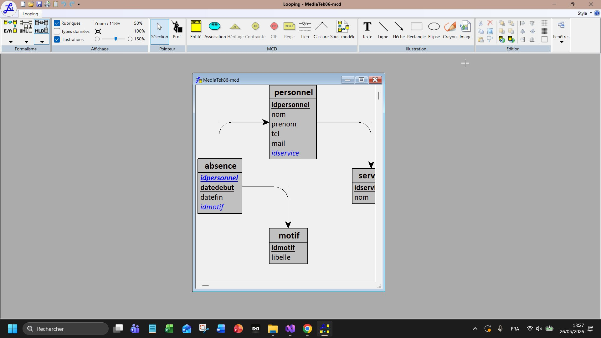
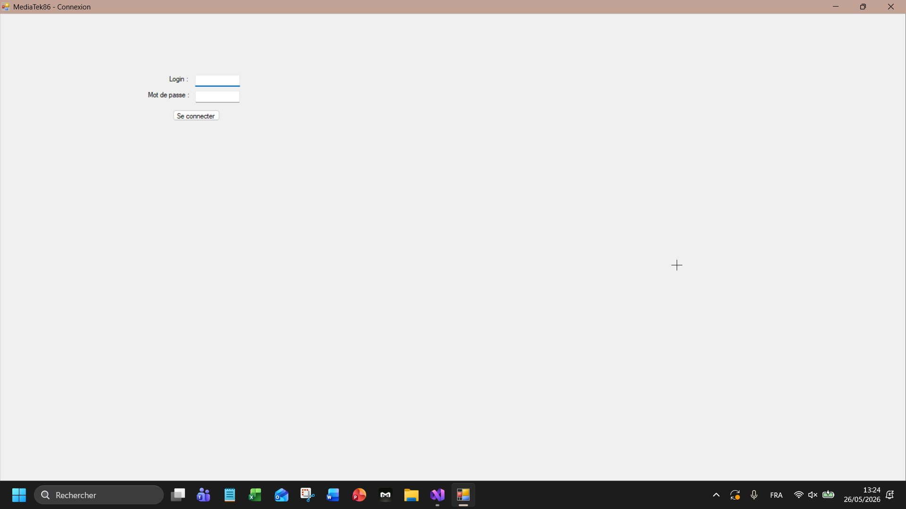
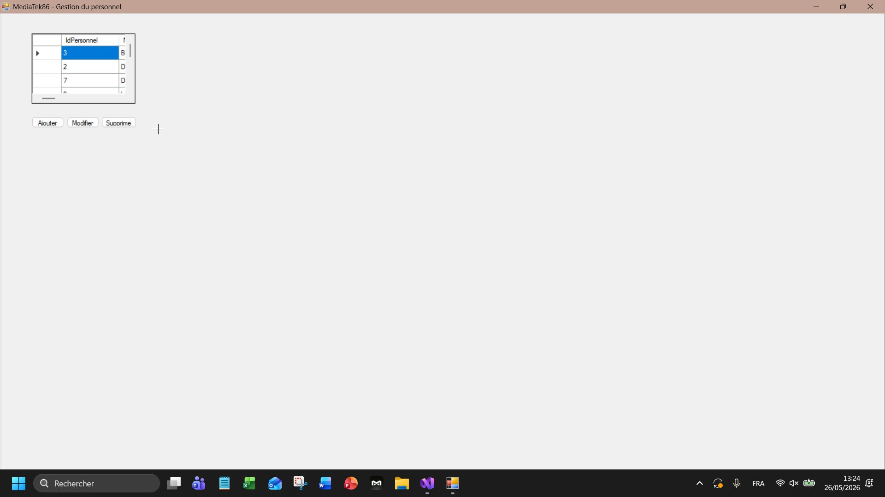
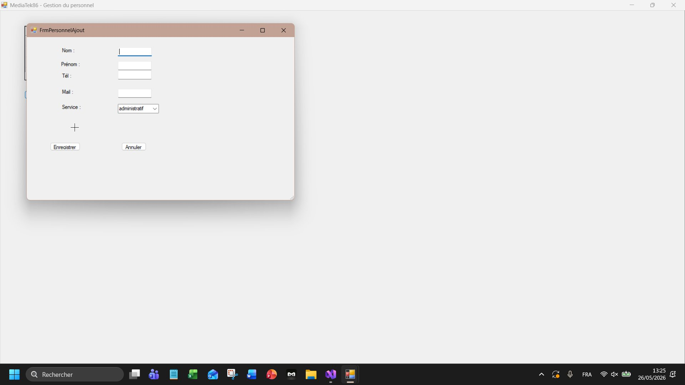
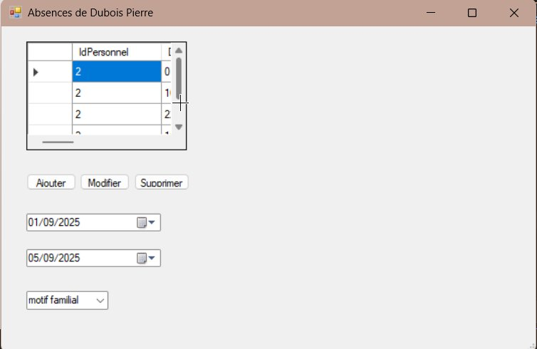
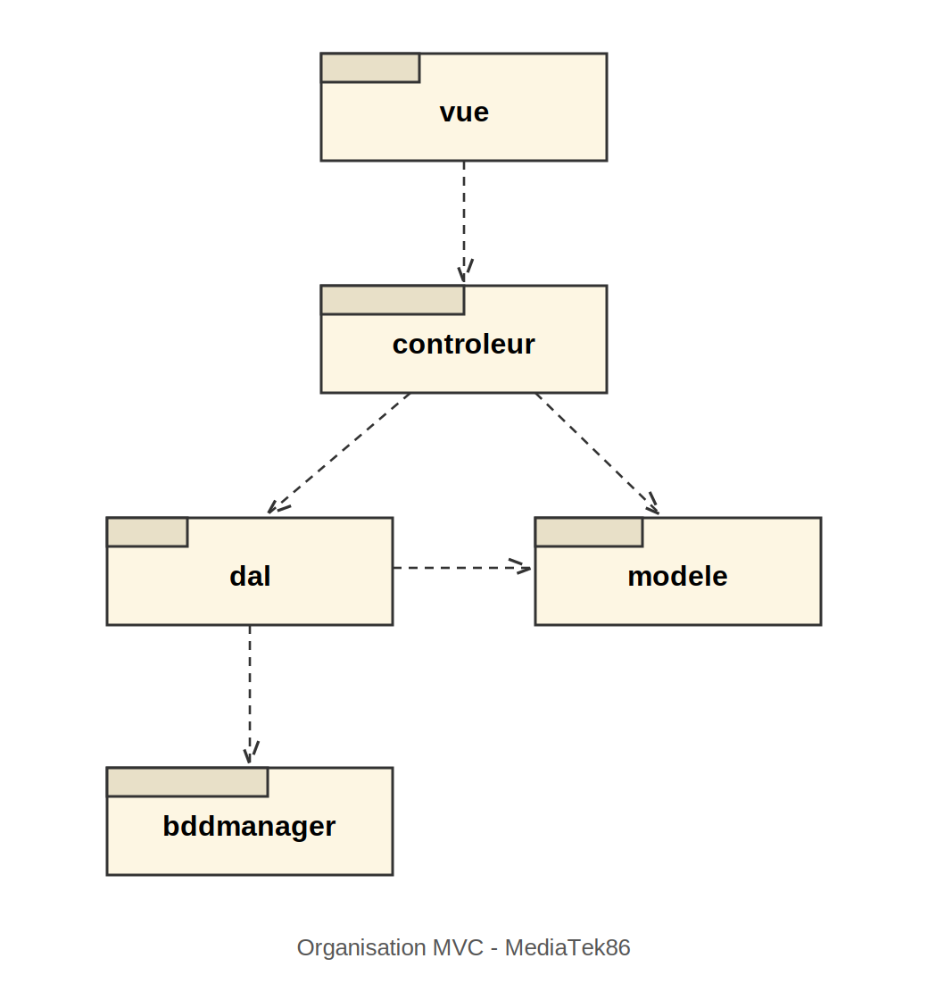

# MediaTek86 - Gestion du personnel

## Contexte et but de l'application

MediaTek86 est un reseau qui gere les mediatheques de la Vienne. Dans le cadre de l'ESN InfoTech Services 86, j'ai developpe une application de bureau (monoposte) qui permet de gerer le personnel des mediatheques, leur affectation a un service et leurs absences.

L'application permet au responsable du personnel de :
- se connecter
- ajouter, modifier et supprimer un personnel
- afficher, ajouter, modifier et supprimer les absences d'un personnel (avec controle des chevauchements de dates)

Application en C# (Windows Forms .NET Framework), architecture MVC, base de donnees MySQL.

## MCD

## Interfaces

Fenetre de connexion :

Liste du personnel :

Ajout / modification d'un personnel :

Gestion des absences :

## Diagramme de paquetages

L'application suit l'architecture MVC, organisee comme l'application Habilitations :

- **vue** : les formulaires Windows Forms
- **controleur** : fait le lien entre la vue et la couche d'acces aux donnees
- **dal** : couche d'acces aux donnees (les requetes SQL)
- **modele** : les classes metier (Personnel, Service, Absence, Motif)
- **bddmanager** : classe singleton de connexion a la base de donnees

## Etapes de construction (commits)

Le developpement s'est fait par etapes, avec une sauvegarde sur le depot a chaque fois :

1. Creation de la base de donnees (5 tables, donnees de test, utilisateur MySQL securise)
2. Structure du projet en MVC + creation du depot GitHub + kanban
3. Codage du visuel des interfaces (formulaires)
4. Codage de la classe BddManager et des classes metier
5. Generation de la documentation technique
6. Fonctionnalite : ajouter un personnel
7. Fonctionnalite : supprimer un personnel
8. Fonctionnalite : modifier un personnel
9. Gestion des absences (afficher, ajouter, modifier, supprimer + controle des chevauchements)
10. Script SQL complet de la base de donnees

Chaque commit a un message explicite pour suivre l'avancement (visible dans l'historique Git et le kanban du projet).

## Installation

1. Installer Wampserver (ou equivalent) pour avoir MySQL.
2. Importer le script SQL `mediatek86.sql` dans phpMyAdmin pour creer la base et ses donnees.
3. Le script cree aussi l'utilisateur MySQL ayant les droits d'acces a la base.
4. Lancer l'installeur de l'application (dossier de l'installeur fourni) pour l'installer sur le poste.
5. Au lancement, se connecter avec le login et le mot de passe du responsable.

## Identifiants de connexion (test)

- Login : admin
- Mot de passe : admin
